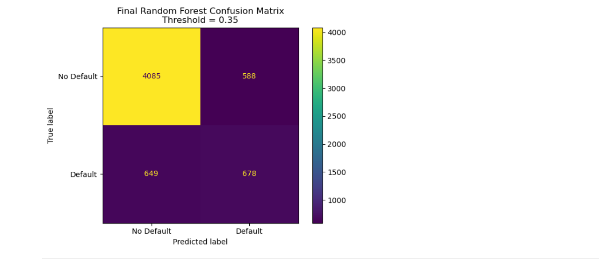
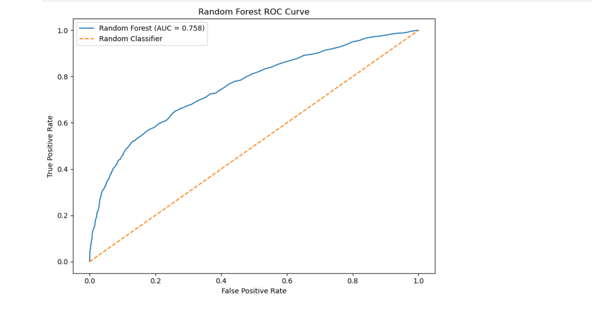
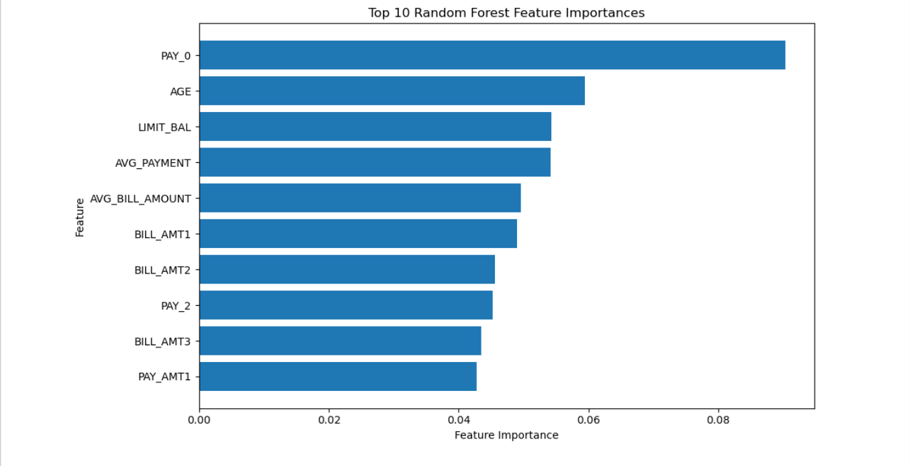

# Credit Card Default Prediction

## Project Overview

This project develops a machine learning classification model to identify customers at risk of credit card default in the following month.

The analysis covers the full data science workflow, including:

- Data cleaning and validation
- Exploratory data analysis
- Feature engineering
- Logistic Regression baseline modelling
- Random Forest modelling
- Class imbalance assessment
- Validation-based classification threshold selection
- Final model evaluation
- Feature importance analysis
- Fairness and responsible modelling considerations

The goal is not only to maximise predictive performance, but also to evaluate the trade-off between identifying customers who may default and incorrectly flagging customers who would not default.

---

## Dataset

The project uses the **Default of Credit Card Clients** dataset from the UCI Machine Learning Repository.

The dataset contains:

- 30,000 customer records
- Credit limit information
- Demographic variables
- Repayment status history
- Monthly bill amounts
- Previous payment amounts
- A binary default target

Target variable:

- `0` = No Default
- `1` = Default

Class distribution:

- No Default: 23,364 customers (77.88%)
- Default: 6,636 customers (22.12%)

Because the target is moderately imbalanced, model evaluation focuses on precision, recall, F1-score and ROC-AUC in addition to accuracy.

Official dataset source:

https://archive.ics.uci.edu/dataset/350/default

Dataset citation:

Yeh, I. (2009). *Default of Credit Card Clients*. UCI Machine Learning Repository.

The dataset is licensed under the Creative Commons Attribution 4.0 International (CC BY 4.0) licence.

---

## Tools and Technologies

- Python
- Pandas
- NumPy
- Matplotlib
- Scikit-learn
- Jupyter Notebook

---

## Data Preparation

The dataset was inspected and prepared before modelling.

Key preparation steps included:

- Correcting the Excel header during import
- Renaming the target variable to `DEFAULT`
- Checking for missing values
- Checking for duplicate records
- Consolidating education categories
- Consolidating unknown marital-status values
- Creating average payment and average bill amount features
- Excluding customer `ID` from model training

Two engineered features were created:

- `AVG_PAYMENT`
- `AVG_BILL_AMOUNT`

These summarise customer payment and billing behaviour across six months.

---

## Exploratory Analysis

### Default Rate

The dataset contains a moderate class imbalance:

- 77.88% No Default
- 22.12% Default

A model predicting every customer as No Default would therefore achieve approximately 77.88% accuracy, demonstrating why accuracy alone is not sufficient.

### Repayment Status

Recent repayment behaviour showed a strong association with default.

`PAY_0`, representing the most recent repayment-status variable, became the most important feature in the final Random Forest model.

Higher delinquency-status categories generally showed substantially higher default rates, although some categories contained relatively small samples.

### Credit Limit

Customers who defaulted had a lower median credit limit:

- No Default: 150,000
- Default: 90,000

This represents an association within the dataset and should not be interpreted as a causal relationship.

### Payment Behaviour

Median average payment was also lower among customers who defaulted:

- No Default: approximately 2,754
- Default: approximately 1,612

Payment behaviour therefore appeared to contain useful predictive information.

---

## Machine Learning Approach

The data was split using stratification to preserve the default-class distribution.

Initial split:

- 80% training data
- 20% test data

The training data was then further divided into:

- Training subset
- Validation subset

The validation set was used for classification-threshold selection.

The test set was excluded from model training.

### Preprocessing

Numerical variables were standardised using `StandardScaler`.

Categorical variables were one-hot encoded using `OneHotEncoder`.

Preprocessing and modelling were combined using Scikit-learn pipelines.

---

## Model Comparison

Three model configurations were evaluated at the default 0.50 classification threshold.

| Model | Accuracy | Precision | Recall | F1 Score | ROC-AUC |
|---|---:|---:|---:|---:|---:|
| Logistic Regression | 80.88% | 69.23% | 24.42% | 36.10% | 70.99% |
| Random Forest | 81.27% | 63.16% | 36.70% | 46.43% | 75.76% |
| Balanced Random Forest | 81.38% | 65.09% | 34.14% | 44.78% | 76.15% |

The Random Forest produced stronger default-class recall and F1-score than the Logistic Regression baseline at the default threshold.

The balanced Random Forest slightly improved ROC-AUC but did not improve recall compared with the standard Random Forest.

---

## Classification Threshold Selection

The default Random Forest threshold of 0.50 identified only around 37% of customers who actually defaulted.

To examine the precision-recall trade-off, several thresholds were evaluated using the validation set.

| Threshold | Accuracy | Precision | Recall | F1 Score |
|---|---:|---:|---:|---:|
| 0.30 | 78.19% | 50.64% | 56.12% | 53.24% |
| 0.35 | 80.15% | 55.51% | 51.69% | 53.53% |
| 0.40 | 80.92% | 58.59% | 46.89% | 52.09% |
| 0.45 | 81.88% | 63.30% | 43.03% | 51.23% |
| 0.50 | 81.92% | 65.75% | 38.14% | 48.27% |

A threshold of **0.35** was selected because it achieved the highest F1-score among the tested validation thresholds while substantially improving recall.

This threshold is not universally optimal. The preferred operating threshold would depend on the relative business cost of missed defaults versus false-positive risk flags.

---

## Final Model Performance

The final Random Forest model was refitted using the full training dataset and evaluated using the selected 0.35 threshold.

Final test results:

| Metric | Result |
|---|---:|
| Accuracy | 79.38% |
| Precision | 53.55% |
| Recall | 51.09% |
| F1 Score | 52.29% |
| ROC-AUC | 75.76% |

The model correctly identified:

- 678 customers who actually defaulted
- 4,085 customers who did not default

It also produced:

- 588 false positives
- 649 false negatives

Out of 1,327 actual default cases in the test set, the model identified 678.

---

## Confusion Matrix



The lower classification threshold improved the model's ability to identify default cases, but also increased the number of false-positive predictions.

---

## ROC Curve



The final Random Forest achieved an ROC-AUC of approximately **0.758**, indicating moderate ability to rank default cases above non-default cases across classification thresholds.

---

## Feature Importance



The most influential Random Forest features included:

1. `PAY_0`
2. `AGE`
3. `LIMIT_BAL`
4. `AVG_PAYMENT`
5. `AVG_BILL_AMOUNT`
6. `BILL_AMT1`
7. `BILL_AMT2`
8. `PAY_2`
9. `BILL_AMT3`
10. `PAY_AMT1`

Random Forest feature importance measures how useful a feature is for reducing impurity across the model's decision trees. It does not indicate causality or the direction of a relationship.

---

## Responsible Modelling and Fairness

Because credit-risk prediction can affect consequential financial decisions, demographic variables require careful consideration.

Exploratory subgroup evaluation was performed for sex and age.

At the original 0.50 Random Forest threshold, recall by sex was approximately:

- Group 1: 35.83%
- Group 2: 37.34%

Performance also varied across age groups.

The oldest age group contained only 58 test observations and 14 defaults, making its metrics particularly unstable.

These checks should not be interpreted as evidence that the model is fair. A production credit-risk system would require substantially more extensive fairness testing, governance, regulatory review and validation.

---

## Key Insights

1. Recent repayment behaviour was one of the strongest signals associated with default.

2. Customers who defaulted tended to have lower credit limits in this dataset.

3. Customers who defaulted also showed lower previous payment amounts.

4. Classification threshold selection materially changed the model's ability to identify default cases.

5. Lowering the Random Forest threshold from 0.50 to 0.35 increased default recall from approximately 37% to 51.09% in the final evaluation.

6. Improving recall came with a trade-off: more non-default customers were incorrectly flagged as potential defaults.

---

## Limitations

- The analysis identifies statistical associations rather than causal relationships.
- The final model still missed 649 of 1,327 actual defaults in the test set.
- Random Forest impurity-based feature importance can be biased and should not be treated as causal explanation.
- `AVG_PAYMENT` and `AVG_BILL_AMOUNT` are derived from existing variables and therefore contain overlapping information.
- Demographic variables such as age and sex require careful ethical, legal and fairness consideration in credit modelling.
- Historical model performance does not guarantee performance on future or different populations.
- This project is an educational portfolio analysis and is not intended for real-world lending decisions.

---

## Repository Structure

```text
credit-default-prediction/
│
├── data/
│   └── README.md
│
├── images/
│   ├── README.md
│   ├── confusion_matrix.png
│   ├── roc_curve.png
│   └── feature_importance.png
│
├── notebooks/
│   ├── README.md
│   └── credit_default_prediction.ipynb
│
├── README.md
└── requirements.txt
